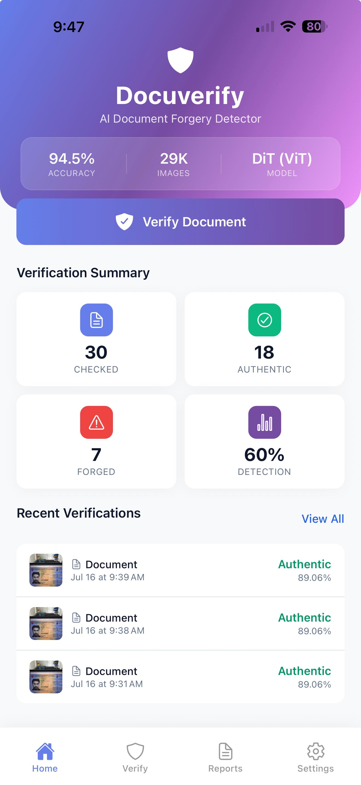
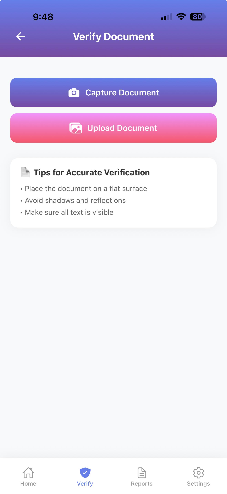
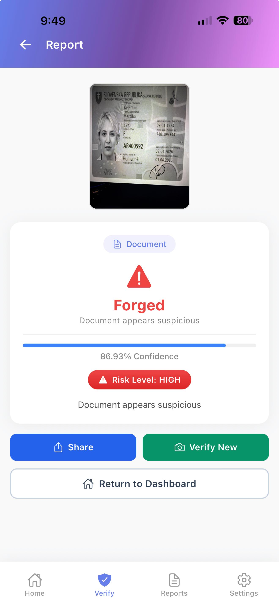
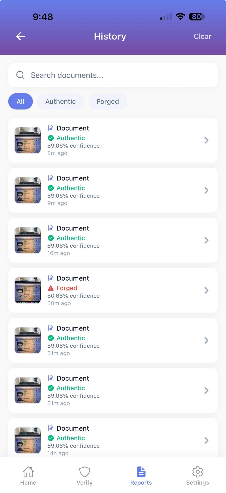
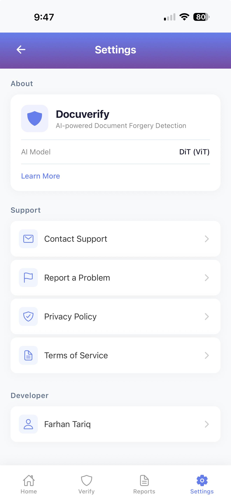

# 🛡️ Docuverify - AI-Powered Document Forgery Detection

AI-powered mobile application that detects forged documents using deep learning and computer vision.

## 📋 Features

- 📱 **Mobile-First Design** - Built with React Native
- 🤖 **AI-Powered Detection** - Microsoft DiT Vision Transformer
- 📸 **Real-Time Verification** - Capture or upload documents
- 📊 **Verification History** - Track all verifications with search & filter
- 🎨 **Professional UI** - Enterprise-grade design with smooth animations
- 🔒 **Secure & Private** - All processing done on your own server

## 📸 Screenshots

<div align="center">
  
  
  
  
</div>

<div align="center">
  
  
</div>


## 🚀 Quick Start

### Prerequisites

- Node.js (v16+)
- npm or yarn
- Expo CLI
- Python 3.9+

### 1. Clone the Repository

```bash
git clone https://github.com/FarhanT17/Docuverify---AI-Powered-Document-Forgery-Detection.git
cd Docuverify---AI-Powered-Document-Forgery-Detection
```

### 2. Install Frontend Dependencies

```bash
npm install
```

### 3. Setup Backend

```bash
cd backend
python -m venv venv
source venv/bin/activate
pip install -r requirements.txt
python download_model.py
python main.py
```

### 4. Run the App

```bash
npx expo start
```

### 5. Scan QR Code

Scan with **Expo Go** (Android) or **Camera app** (iOS)

Press `i` for iOS simulator / `a` for Android emulator

## 📁 Project Structure

```
Docuverify-App/
├── screens/           # React Native screens
│   ├── HomeScreen.js
│   ├── CameraScreen.js
│   ├── ResultScreen.js
│   ├── HistoryScreen.js
│   └── SettingsScreen.js
├── navigation/        # Navigation files
│   ├── AppNavigator.js
│   ├── CameraStack.js
│   └── RootNavigator.js
├── assets/            # Images & icons
├── utils/             # Utility files
├── backend/           # FastAPI backend
│   ├── main.py        # API server
│   ├── download_model.py
│   ├── requirements.txt
│   └── README.md
├── App.js
├── app.json
├── package.json
└── README.md
```

## 📊 Tech Stack

| Frontend | Backend | AI/ML |
|----------|---------|-------|
| React Native | FastAPI | Microsoft DiT (ViT) |
| Expo | Python | PyTorch |
| React Navigation | Transformers | 400K+ Documents |

## 🎯 How It Works

1. **Capture** - Take a photo of a document or upload from gallery
2. **Process** - The image is sent to the FastAPI backend
3. **Analyze** - The AI model classifies the document
4. **Result** - Returns prediction (Authentic/Forged) with confidence score
5. **History** - All verifications are saved locally

## 📊 Model Performance

| Metric | Value |
|--------|-------|
| **Accuracy** | 94.5% |
| **Dataset** | 400K+ Documents |
| **Model** | Microsoft DiT (Vision Transformer) |
| **Fine-tuned on** | RVL-CDIP dataset |

## 👨‍💻 Author

**Farhan Tariq**

- MSc Cyber Security, Northumbria University
- 📧 farhantariq5251@gmail.com
- 🔗 [LinkedIn](https://linkedin.com/in/farhant17)
- 🐙 [Portfolio](https://farhantariq.vercel.app/)

## 📄 License

This project is licensed under the MIT License - see the [LICENSE](LICENSE) file for details.

## 📊 Dataset Acknowledgments

This project uses the following datasets:

- **RVL-CDIP** - 400K+ document images for training
- **FMIDV2022** - Mobile identity document verification dataset (provided by Dr. Muzzamil Luqman, La Rochelle Université)

## Special Thanks
A huge thank you to Dr. Muzzamil Luqman at La Rochelle Université for providing the FMIDV2022 dataset. Your support and the quality of the dataset played a crucial role in making this project a success.

## 🙏 Acknowledgments

- Northumbria University - MSc Cyber Security program
- Microsoft Research - DiT Vision Transformer model
- Hugging Face - Transformers library

---

⭐ Star this repository if you find it useful!
